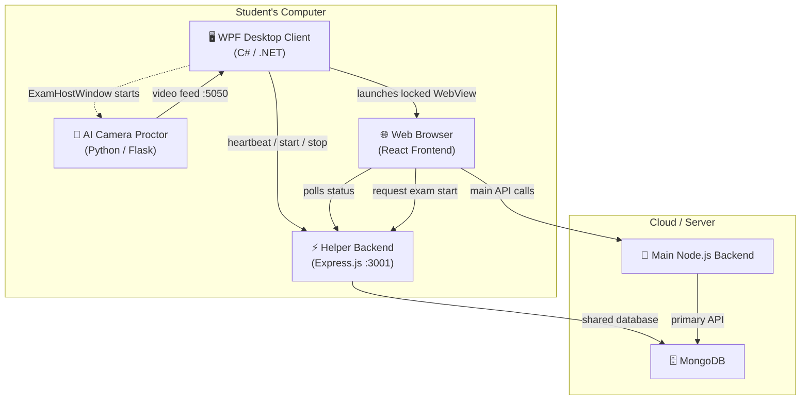
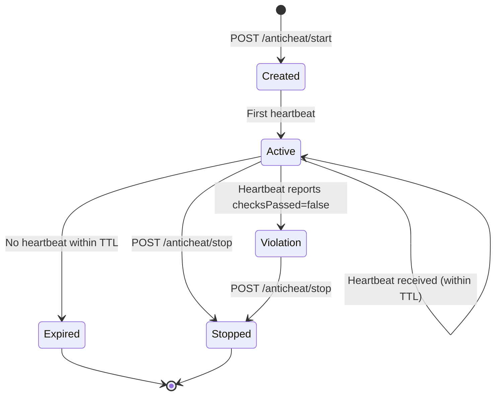
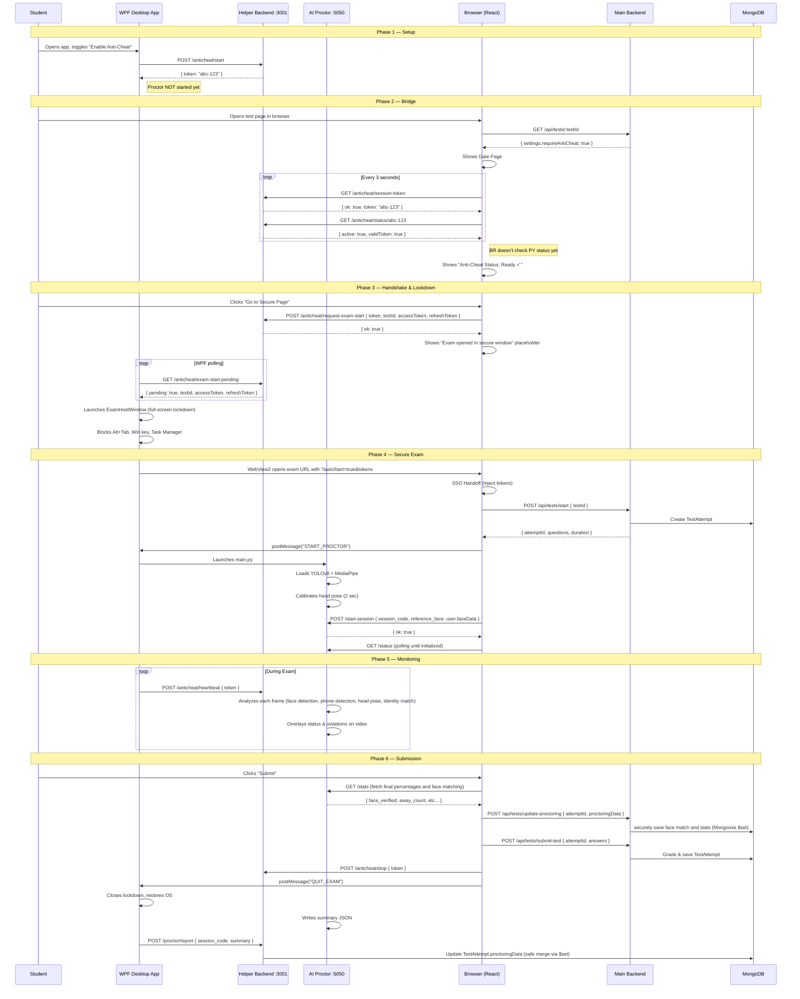

# 🛡️ LearnHub Proctor / Anti-Cheat System — Full Explanation

> A comprehensive technical and functional walkthrough of the proctoring system used in the LearnHub e-learning platform.

---

## Table of Contents

1. [Overview](#1-overview)
2. [Architecture — The 4 Components](#2-architecture--the-4-components)
3. [Connection Workflow (Step-by-Step)](#3-connection-workflow-step-by-step)
4. [Component Deep-Dives](#4-component-deep-dives)
   - [A. AI Camera Proctor (`main.py`)](#a-ai-camera-proctor-mainpy)
   - [B. WPF Desktop Client (`wpf-app/`)](#b-wpf-desktop-client-wpf-app)
   - [C. Express Helper Backend (`express-backend/`)](#c-express-helper-backend-express-backend)
   - [D. React Web Frontend](#d-react-web-frontend)
5. [Backend Enforcement Rules](#5-backend-enforcement-rules)
6. [Database Schema](#6-database-schema)
7. [Teacher-Side: Anti-Cheat Report](#7-teacher-side-anti-cheat-report)
8. [API Endpoint Reference](#8-api-endpoint-reference)
9. [Sequence Diagram](#9-sequence-diagram)

---

## 1. Overview

The **Proctor/Anti-Cheat system** is a multi-component architecture that creates a **secure, inescapable, AI-monitored exam environment**. It bridges the gap between the standard web platform and the student's local operating system to prevent cheating during high-stakes "Final Exam" tests.

### Key Goals

| Goal | How It's Achieved |
|------|-------------------|
| **Prevent tab-switching / alt-tabbing** | WPF desktop app locks down the OS, blocks keyboard shortcuts |
| **Prevent using a phone** | AI camera detects phones via YOLOv8 object detection |
| **Prevent someone else taking the exam** | AI detects multiple persons or no person in camera frame |
| **Detect looking away from screen** | MediaPipe head-pose estimation checks pitch/yaw against calibration |
| **Ensure continuous monitoring** | Heartbeat system with TTL — if heartbeat stops, session is flagged |
| **Single attempt enforcement** | Backend enforces one-attempt-only for anti-cheat tests |

---

## 2. Architecture — The 4 Components

The system relies on **four main pieces** working together:



| # | Component | Technology | Port | Role |
|---|-----------|-----------|------|------|
| 1 | **Web App** | React + Main Node.js Backend | `5000` | Standard e-learning platform |
| 2 | **Helper Backend** | Express.js | `3001` | Local middleman between browser & desktop app |
| 3 | **WPF Desktop Client** | C# / WPF / .NET | — | OS lockdown, secure exam host |
| 4 | **AI Camera Proctor** | Python / Flask / OpenCV / YOLOv8 | `5050` | Real-time AI violation detection |

---

## 3. Connection Workflow (Step-by-Step)

Here's exactly what happens when a student takes a proctored exam:

### Phase 1 — Setup
1. **Student opens the WPF Desktop Application** (`MainWindow.xaml`) on their computer.
2. **Student toggles "Enable Anti-Cheat"** in the app.
3. The WPF app contacts the local Helper Backend (`POST /api/anticheat/start`) to **generate a unique session token**.
4. The system is now in **Protected** mode, waiting for an exam request from the browser.

### Phase 2 — Bridge
5. The student opens their **web browser** (Chrome/Edge) and navigates to the test page.
6. The React frontend **detects this is an anti-cheat exam** (`test.settings.requireAntiCheat === true`).
7. It **pings the local Helper Backend** (`GET /api/anticheat/session-token`) every 3 seconds to check if the WPF app is running.
8. Once detected, the UI shows **"Anti-Cheat Status: Ready"** with a green badge.

### Phase 3 — Handshake & Lockdown
9. The student clicks **"Go to Secure Page"** in the browser.
10. The browser sends a **request-exam-start** signal to the Helper Backend, including the `testId`, `accessToken`, and `refreshToken`.
11. The WPF app, which is **constantly polling** the Helper Backend (`GET /api/anticheat/exam-start-pending`), picks up this request.
12. The WPF app immediately launches the **`ExamHostWindow`** in **full-screen mode**, completely locking down the computer.

### Phase 4 — Secure Exam
13. Inside the locked window, a **WebView2** (embedded Edge browser) opens the test page with injected authentication tokens (SSO handoff via URL params).
14. The student sees the exam questions inside the locked, full-screen window — **no address bar, no tab switching, no escape**.
15. The locked browser sends a `START_PROCTOR` message via `window.chrome.webview.postMessage`.
16. The **WPF app now launches the AI Proctor (`main.py`)**. It initializes (loads YOLO/MediaPipe) and begins its calibration (2 seconds).
17. Once ready, the AI proctor session is initialized for the specific attempt.

### Phase 5 — Continuous Monitoring
18. The **Python script** watches via webcam in real-time (YOLOv8 + MediaPipe).
19. The WPF app sends **heartbeats** to the Helper Backend every 3-8 seconds.
20. The student's live AI-analyzed camera feed is displayed as a small overlay inside the exam.
21. Upon submission, the anti-cheat session is stopped and **proctoring data is saved** to the `TestAttempt` document in MongoDB.

---

## 4. Component Deep-Dives

### A. AI Camera Proctor (`main.py`)

> **Location:** `anti cheat/main.py`  
> **Port:** `5050`  
> **Technology:** Python, Flask, OpenCV, MediaPipe, Ultralytics YOLOv8

This is the "brain" of the proctoring system — a Python script launched by the **ExamHostWindow** only after the computer is securely locked.

#### What It Does

| Detection | Method | Threshold |
|-----------|--------|-----------|
| **Looking Away** | MediaPipe Face Mesh → Head-pose estimation (pitch/yaw) | `> 110×1.35°` yaw or `> 140×1.35°` pitch from calibrated baseline |
| **Phone Detected** | YOLOv8 object detection (`"cell phone"`, `"book"`) | Any detection counts |
| **Multiple People** | MediaPipe Face Detection — counts detections | `> 1` face |
| **No Person** | MediaPipe Face Detection | `0` faces |
| **Identity Mismatch** | `face_recognition` (dlib) encoding | Live face fails to match `reference_face` profile image |

#### How It Works

1. **Initialization** — Loads `yolov8n.pt` (6.5MB neural network model), MediaPipe Face Mesh, and Face Detection.
2. **Camera Access** — Tries indices 0-2 with DirectShow (Windows), falls back to default.
3. **Calibration Phase** — First 2 seconds: captures the student's natural head position as baseline (pitch/yaw).
4. **Main Loop** — Processes every frame:
   - MediaPipe (every frame — lightweight): face detection, head-pose estimation.
   - YOLOv8 (every 10th frame — heavy): object detection for phones.
   - Face Recognition (every 20th frame): compares live face encodings to the student's `reference_face`.
5. **Annotations** — Overlays text on the video frame ("LOOKING AWAY!", "MATCH / MISMATCH", etc.).
6. **Live Video Server** — Hosts an MJPEG stream at `http://127.0.0.1:5050/video_feed` for the WPF app/browser to consume.

#### Key Endpoints

| Endpoint | Method | Purpose |
|----------|--------|---------|
| `/status` | GET | Returns `{ running, initialized }`. React and WPF use this to check readiness. |
| `/start-session` | POST | Sets the current session code (attempt ID). |
| `/stats` | GET | Returns real-time violation percentages. |
| `/video_feed` | GET | MJPEG live video stream. |

#### Head-Pose Estimation Detail

Uses a **Perspective-n-Point (PnP)** approach:
- 6 facial landmarks (nose tip, chin, left/right eye corners, mouth corners) are mapped to a 3D model.
- OpenCV's `solvePnP` computes the rotation matrix → Euler angles (pitch, yaw, roll).
- Compared against the calibrated baseline to determine if the student is looking away.

```python
# Core check — is the student looking away?
def is_looking_away(pitch, yaw):
    return (abs(pitch - calibrated_pitch) > MAX_PITCH_OFFSET or 
            abs(yaw - calibrated_yaw) > MAX_YAW_OFFSET)
```

---

### B. WPF Desktop Client (`wpf-app/`)

> **Location:** `anti cheat/wpf-app/`  
> **Technology:** C# / .NET / WPF / WebView2

This is the **OS-level lockdown** component — a native Windows application.

#### Key Files

| File | Purpose |
|------|---------|
| `MainWindow.xaml` / `MainViewModel.cs` | User-facing dashboard — toggle anti-cheat, poll for exam requests |
| `ExamHostWindow.xaml` / `.xaml.cs` | **Full-screen secure exam host** — the critical security component |
| `LockdownWindow.xaml` / `.xaml.cs` | Secondary lockdown layer |
| `AppConfig.cs` | Configuration (API URLs, ports) |

#### ExamHostWindow — How It Locks Down

When the exam starts, this window takes over the entire screen:

| Lock Mechanism | Implementation |
|----------------|---------------|
| **Block Alt+Tab, Win key, Ctrl+Esc** | Low-level keyboard hook via `SetWindowsHookEx` (Windows API) |
| **Disable Task Manager** | Registry edit: `HKCU\Software\Microsoft\Windows\CurrentVersion\Policies\System\DisableTaskMgr` |
| **Hide Log Off screen** | Registry modification |
| **Full-screen, no chrome** | Window state set to Maximized, no decorations, topmost |
| **Embedded browser** | WebView2 (Edge engine) — navigates to exam URL without address bar |
| **Camera overlay** | Connects to Python's `http://127.0.0.1:5050/video_feed` for live camera display |

#### MainViewModel — Polling Logic

The `MainViewModel` continuously polls:
- `GET /api/anticheat/exam-start-pending` — checks if the student clicked "Start Exam" in the browser.
- When a pending request arrives → launches `ExamHostWindow` with the test URL + injected tokens.
- Sends `POST /api/anticheat/heartbeat` every 8 seconds to keep the session alive.

---

### C. Express Helper Backend (`express-backend/`)

> **Location:** `anti cheat/express-backend/`  
> **Port:** `3001`  
> **Technology:** Node.js, Express, MongoDB (shared DB with main backend)

This local server is the **middleman** — a standard web browser cannot directly communicate with a WPF desktop app due to security sandboxing, so this Express server acts as the bridge.

#### Why It Exists

```
Browser (React) ←→ Helper Backend ←→ WPF Desktop App
                        ↕
                   Same MongoDB
```

The Helper Backend also has its own **Exam API replica**. Because the WPF's `ExamHostWindow` is isolated (embedded WebView2 with no direct access to the main backend's auth flow), this helper backend handles exam starting and submission within the secure environment.

#### Key Responsibilities

| Responsibility | API Routes |
|----------------|-----------|
| **Session Management** | `POST /api/anticheat/start`, `POST /api/anticheat/stop` |
| **Heartbeat / TTL** | `POST /api/anticheat/heartbeat` — if no heartbeat within TTL, session becomes inactive |
| **Status Polling** | `GET /api/anticheat/status/:token` — React checks if desktop app is alive |
| **Token Discovery** | `GET /api/anticheat/session-token` — browser discovers if a session exists |
| **Bridge (Handshake)** | `POST /api/anticheat/request-exam-start` → `GET /api/anticheat/exam-start-pending` |
| **Proctor Reports** | `POST /api/proctor/report` — saves AI proctoring data to `TestAttempt.proctoringData` |
| **Exam API Replica** | `POST /api/exam/:testId/start`, `POST /api/exam/submit` |
| **Token Refresh** | `POST /api/auth/refresh` — refreshes expired JWT access tokens inside the locked browser |

#### Session Lifecycle



---

### D. React Web Frontend

> **Location:** `learnhub-elearning/frontend/src/pages/Tests/TakeTest.jsx`

The React frontend handles the entire student-facing exam flow, adapting its behavior based on whether anti-cheat is required.

#### Gate Page (Anti-Cheat Required, Normal Browser)

When a student opens a proctored test in a normal browser, they see a **gate page** instead of the normal start screen:

1. **Anti-Cheat Status Card** — Shows "Ready" (green) or "Not Detected" (red).
2. **Instructions** — "Open the LearnHub Anti-Cheat app, turn protection ON, wait for detection."
3. **"Go to Secure Page" Button** — Only enabled when anti-cheat is detected AND within the schedule window.

The frontend polls the Helper Backend every **3 seconds**:

```
GET http://localhost:3001/api/anticheat/session-token  → Token discovery
GET http://localhost:3001/api/anticheat/status/:token  → Active/violation check
GET http://localhost:5050/status                       → Python proctor check
```

#### Inside the Locked Browser (Auto-Start via WebView2)

When running inside the WPF's WebView2:
- URL contains `?autoStart=true&accessToken=xxx&refreshToken=xxx`.
- Performs **SSO handoff** — injects tokens into localStorage and Zustand store.
- Sends `START_PROCTOR` message to WPF via `window.chrome.webview.postMessage`.
- Waits for the Python camera to initialize before showing questions.
- On submission, sends `QUIT_EXAM` to WPF to close the locked window.

#### AI Proctor Live Feed

During the exam, a small floating panel shows:
- **Live camera feed** from `http://localhost:5050/video_feed` (MJPEG stream).
- Label: **"AI Proctor Live — MONITORING"** for proctored exams.
- Fallback: Shows **"AI Proctor Offline"** if the feed fails to load.

#### Key State Variables

| Variable | Purpose |
|----------|---------|
| `antiCheatActive` | Whether the Helper Backend session is alive |
| `antiCheatToken` | The session token from the desktop app |
| `proctorActive` | Whether the Python AI proctor is responding |
| `examLockedByAntiCheat` | Whether the normal browser should show the "locked" placeholder |
| `secureLaunched` | Whether the "Go to Secure Page" button was already clicked |
| `waitingForCamera` | Blocking state while camera initializes in WebView |

---

## 5. Backend Enforcement Rules

The main Node.js backend (`testController.js`) enforces several rules for proctored tests:

### Test Creation
- Any test with `type: 'final'` **automatically** has `requireAntiCheat: true` set, regardless of the teacher's choice.
- Quizzes can optionally enable anti-cheat.

### Test Taking
| Rule | Implementation |
|------|---------------|
| **Single attempt** | Anti-cheat tests allow only **one attempt** — if an in-progress attempt exists and no resume is requested, it gets auto-closed and the student is blocked |
| **No resume** | Unlike normal tests (which save to localStorage and can be refreshed), anti-cheat test progress is **not persisted** to localStorage |
| **Previous attempts deleted** | For normal tests, previous attempts are deleted before starting a new one. For anti-cheat tests, they are preserved and block retakes |
| **Schedule validation** | Tests respect `scheduleWindows[]` (multi-window) or legacy `scheduledStartTime`/`scheduledEndTime` |
| **Enrollment check** | If the test belongs to a course, the student must be enrolled |
| **Block check** | If the student is blocked from the course, they cannot take its tests |

### Course Completion
- If a `final` type test is passed → the student's enrollment is marked as `completed`, `certificateEarned: true`, `progress: 100%`.

---

## 6. Database Schema

### Test Settings (relevant fields)

```javascript
settings: {
    duration: Number,              // Duration in minutes
    requireCamera: Boolean,        // Require camera (non-AI)
    requireAntiCheat: Boolean,     // ← THE KEY FLAG — enables entire anti-cheat system
    scheduledStartTime: Date,
    scheduledEndTime: Date,
    scheduleWindows: [{            // Multi-window support
        startTime: Date,
        endTime: Date
    }],
    passingScore: Number,          // e.g. 60 (percent)
    shuffleQuestions: Boolean,
    showResults: Boolean,
}
```

### TestAttempt — Proctoring Data

After the exam is submitted, the AI proctor's report is saved:

```javascript
proctoringData: {
    lookingAwayCount: Number,              // Raw count of frames
    phoneDetectedCount: Number,            // Raw count of frames  
    multiplePersonsCount: Number,          // Raw count of frames
    noPersonCount: Number,                 // Raw count of frames
    lookingAwayPercent: Number,            // Percentage of total frames
    phoneDetectionPercent: Number,         // Percentage of total frames
    unauthorizedPersonPercent: Number,     // Percentage of total frames
    noPersonPercent: Number,               // Percentage of total frames
}
```

> [!NOTE]
> Percentages are calculated as `(violation_frame_count / total_frames) × 100`. The Python script writes these to a summary JSON file on disk, which the WPF app then sends to the Helper Backend's `POST /api/proctor/report` endpoint.

---

## 7. Teacher-Side: Anti-Cheat Report

> **Location:** `TestParticipants.jsx`

When a teacher views the participants of a proctored test, each submitted attempt displays an **Anti-Cheat Report** panel with four metrics:

| Metric | Icon | Color Logic |
|--------|------|-------------|
| **Looking Away** | 👁️ EyeOff | `> 15%` → Red, `> 5%` → Yellow, else → Gray |
| **Phone** | 📱 Smartphone | `> 0 detections` → Red, else → Gray |
| **Multiple People** | 👥 Users2 | `> 0 detections` → Red, else → Gray |
| **No Person** | 🚫 UserX | `> 0 detections` → Yellow, else → Gray |

Each metric shows both the **percentage** and the **raw occurrence count**.

> [!TIP]
> The color thresholds provide a quick visual triage — a red card means a strong suspicion of cheating, yellow is a warning, and gray is clean.

---

## 8. API Endpoint Reference

### Anti-Cheat Session API (Helper Backend `:3001`)

| Method | Endpoint | Caller | Purpose |
|--------|----------|--------|---------|
| `POST` | `/api/anticheat/start` | WPF | Create a new session → returns token |
| `GET` | `/api/anticheat/status/:token` | React | Check if session is active/valid |
| `POST` | `/api/anticheat/heartbeat` | WPF | Keep session alive (every 8s) |
| `GET` | `/api/anticheat/session-token` | React | Discover if any active session exists |
| `POST` | `/api/anticheat/request-exam-start` | React | Tell WPF to launch the locked exam |
| `GET` | `/api/anticheat/exam-start-pending` | WPF | Poll for pending exam-start requests |
| `POST` | `/api/anticheat/stop` | React/WPF | Terminate the session |

### Proctor API (Helper Backend `:3001`)

| Method | Endpoint | Caller | Purpose |
|--------|----------|--------|---------|
| `POST` | `/api/proctor/reset` | WPF | Reset report when a new exam starts |
| `POST` | `/api/proctor/report` | WPF | Push final AI report + save to DB |
| `GET` | `/api/proctor/report` | React | Read latest report |
| `GET` | `/api/proctor/frame` | React | Fetch latest camera frame (fallback) |

### AI Proctor API (Python `:5050`)

| Method | Endpoint | Caller | Purpose |
|--------|----------|--------|---------|
| `GET` | `/status` | React/WPF | Check if proctor is running and initialized |
| `POST` | `/start-session` | React | Set the session code for tracking |
| `GET` | `/stats` | Any | Get real-time violation percentages |
| `GET` | `/video_feed` | React/WPF | MJPEG live camera stream |

---

## 9. Sequence Diagram



---

> [!IMPORTANT]
> The entire anti-cheat system only activates when `test.settings.requireAntiCheat === true`. This flag is **automatically set** for all tests with `type: 'final'` and can be **manually enabled** for regular quizzes by the instructor during test creation.

> [!CAUTION]
> The OS lockdown (keyboard hooks, registry edits) is **Windows-only**. The WPF app will only work on Windows machines with .NET and WebView2 installed. macOS/Linux students cannot take proctored exams.
